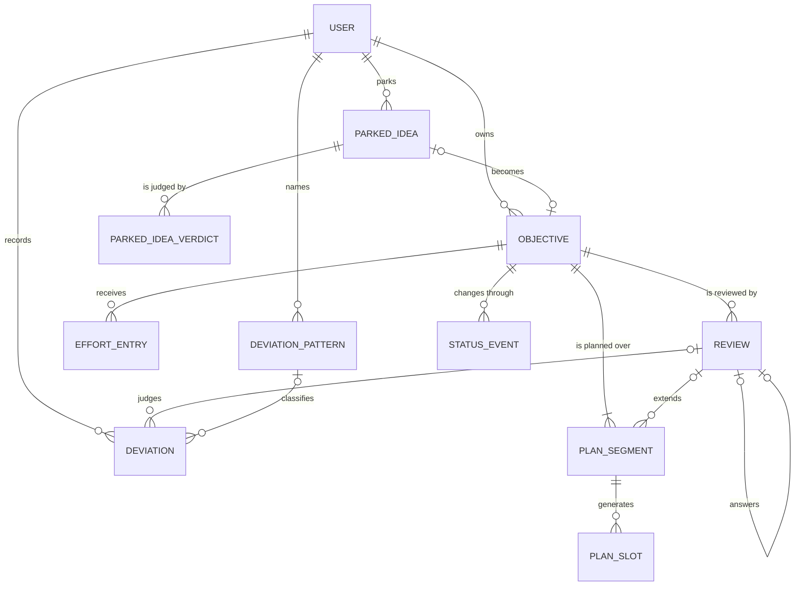
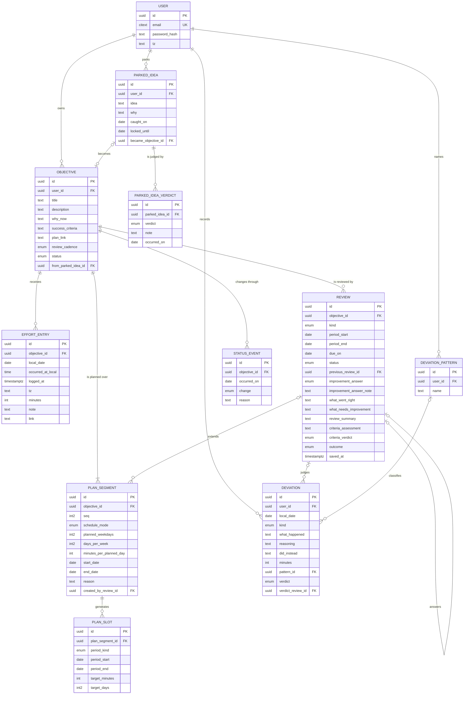

# Keel — entity model and invariants

Sprint 00 · Story W2-09 · **Revision 2** · 11 entities, 16 invariants, 0 stored aggregates

Built against the current 15 screens. **NFR-06 (offline logging) is out of scope for v1.**

## What revision 2 changed

Review found two things. The Review table was missing four fields visible on screen (`what_went_right`, `what_needs_improvement`, `review_summary`, plus the plan-end criteria assessment). Chasing those surfaced a structural error:

- **`plan_segment` is new.** The Continue dialog carries its own schedule — *"change anything that is no longer true, Wednesdays for instance"* — so a schedule is a versioned thing, not a property of the objective. Objective no longer holds schedule fields or an end date; those live on segments and the objective's dates are derived from them.
- **`parked_idea_verdict` is new.** The review detail screen has a column headed *status then*. A current-verdict column cannot answer that, and verdicts can flip — a dropped idea can be revived.
- The entity count went from 9 to 11. It was never a target.

## Decisions this model rests on

- **A deviation belongs to a user and a date, not an objective.**
- **An extension must reach a date strictly in the future** — refused, not adjusted.
- **Only a plan-end review may change the plan.**

## The shape

## Full model

## Entities

### Objective — `objective`

What you committed to. Note what is *not* here: no schedule, no end date. Those moved to plan segments, because an extension can change them.

| Column | Type | Why |
|---|---|---|
| id | uuid PK |  |
| user_id | uuid FK -> user | Every query filters on this (NFR-10). |
| title / description / why_now / success_criteria | text | From the New objective screen. |
| plan_link | text null | The external spreadsheet. Keel stores the link, never the plan. |
| review_cadence | enum('weekly','monthly') | A plan-end review is always created regardless of cadence. |
| status | enum('active','paused','completed','ended') | No 'deleted'. Ending is possible; deleting is not. |
| from_parked_idea_id | uuid null FK | Drives the "FROM PARKING LOT" badge on the objectives list. |
| — not stored — |  | **Current end date** is the latest segment's end. **Original end date** is segment 0's end. **Extension count** is a row count. All derived. |

### Plan segment — `plan_segment`

**The correction.** The Continue dialog carries its own schedule — "change anything that is no longer true, Wednesdays for instance" — so a schedule is a versioned thing, not a property of the objective.

| Column | Type | Why |
|---|---|---|
| id | uuid PK |  |
| objective_id | uuid FK |  |
| seq | int2 | 0 is the original plan. 1, 2, 3 are extensions — this is what "Extension 2" and "extended 3 times" read from. |
| schedule_mode | enum('fixed','flexible') | Can differ from the previous segment. That is the whole point. |
| planned_weekdays | int2 null | Bitmask Mon–Sun. Null when flexible. |
| days_per_week | int2 null | Null when fixed. |
| minutes_per_planned_day | int |  |
| start_date / end_date | date | Contiguous with the previous segment; never overlapping. |
| reason | text | **NOT NULL.** The Continue dialog marks "why extend rather than complete?" as required, so the schema should too. Segment 0's reason is the objective's creation reason. |
| created_by_review_id | uuid null FK | Null on segment 0. Set by the plan-end review that extended. |

### Plan slot — `plan_slot`

One row per planned unit, generated from its segment. Fixed schedules make day rows; flexible ones make week rows.

| Column | Type | Why |
|---|---|---|
| id | uuid PK |  |
| plan_segment_id | uuid FK | **Belongs to the segment, not the objective** — that is how a slot inherits the schedule that was in force when it was made. |
| period_kind | enum('day','week') |  |
| period_start / period_end | date | Equal for a day row. Monday to Sunday for a week row. |
| target_minutes | int | minutes_per_planned_day for a day; days_per_week × that for a week. |
| target_days | int2 null | Week rows only. What "4 of 5 days done" counts against. |
| unique | (plan_segment_id, period_start, period_kind) |  |

### Effort entry — `effort_entry`

What you actually did. Several per day per objective is normal.

| Column | Type | Why |
|---|---|---|
| id | uuid PK |  |
| objective_id | uuid FK | On the objective, not the segment — effort survives a schedule change. |
| local_date | date | **The day you meant.** Stored, never derived, never moves (NFR-12). |
| occurred_at_local | time null | The WHEN column — when the work happened, which is not when you logged it. |
| logged_at | timestamptz | The instant the row was written. |
| tz | text | The zone it was logged in, e.g. Asia/Kolkata. |
| minutes | int |  |
| note | text | "what you did". |
| link | text null | "#d14a", "#keel/32". |

### Review — `review`

Per objective, per period. The three free-text fields are marked on screen as *reviewed outside Keel; recorded here* — they are your judgement from the plan spreadsheet, which is why Keel cannot compute them.

| Column | Type | Why |
|---|---|---|
| id | uuid PK |  |
| objective_id | uuid FK |  |
| kind | enum('weekly','monthly','plan_end') |  |
| period_start / period_end | date | Every figure on the screen covers this window only. |
| due_on | date |  |
| status | enum('draft','saved') | The draft is S24. At most one per objective and period. |
| previous_review_id | uuid null FK | Whose `what_needs_improvement` this one answers. |
| improvement_answer | enum('yes','partly','no') null | "Did it happen?" |
| improvement_answer_note | text null |  |
| what_went_right | text null | **Was missing.** From the plan spreadsheet. |
| what_needs_improvement | text null | **Was missing.** This is the sentence the *next* review quotes back at you, and the one "the sentence that repeats" is detected from. |
| review_summary | text null | **Was missing.** The one line shown in the reviews list. |
| criteria_assessment | text null | **Was missing.** Plan-end only — "two of three, one still with notes open". A weekly review says explicitly that it does not assess this. |
| criteria_verdict | enum('met','partly_met','not_met') null | **Was missing.** Plan-end only. Drives "Completed · partly met". |
| outcome | enum('continued','completed','paused','ended') null | Plan-end only. |
| saved_at | timestamptz null | Null while a draft. |
| — not stored — |  | Adherence, logged/target, planned days, target met, the per-day bars, deviation costs, "review 7 of the plan". All recomputed when the review is opened. |

### Deviation — `deviation`

Belongs to you and a date — not to an objective. Your call, and it matches the screen as drawn.

| Column | Type | Why |
|---|---|---|
| id | uuid PK |  |
| user_id | uuid FK | No objective_id. |
| local_date | date |  |
| kind | enum('chosen','drifted') |  |
| what_happened / reasoning / did_instead | text | Reasoning is recorded now and tested at review. |
| minutes | int | The cost. Never subtracted from effort — a separate ledger. |
| pattern_id | uuid null FK | Null means "a genuine one-off", which is a real answer. |
| verdict | enum('worth_it','not_worth_it') null | Chosen deviations only. |
| verdict_review_id | uuid null FK | Which review judged it. Null together with verdict. |

### Parked idea — `parked_idea`

The lock is the point. An idea you cannot act on for three weeks is an idea you can judge honestly.

| Column | Type | Why |
|---|---|---|
| id | uuid PK |  |
| user_id | uuid FK |  |
| idea / why | text | "The honest reason — this is the part worth having later." |
| caught_on | date |  |
| locked_until | date | Set when parked. Never moves. |
| became_objective_id | uuid null FK | Set when a verdict of 'taken' is recorded. |
| — not stored — |  | **The current verdict.** It is the latest verdict event — see below. |

### Parked idea verdict — `parked_idea_verdict`

**The second correction.** The review detail screen has a column headed *status then*. A current-verdict column cannot answer that, and verdicts can flip — a dropped idea can be revived.

| Column | Type | Why |
|---|---|---|
| id | uuid PK |  |
| parked_idea_id | uuid FK |  |
| verdict | enum('parked','taken','dropped') |  |
| note | text null | "why it ended" — edited on the row. |
| occurred_on | date | Current verdict = the latest row. *Status then* = the latest row on or before the review's period end. |

### Deviation pattern — `deviation_pattern`

A named shape you recognise — "Planning instead of doing". The "3 before" count is computed, never stored.

| Column | Type | Why |
|---|---|---|
| id / user_id / name |  |  |

### Status event — `status_event`

Created, paused, resumed, completed, ended — with the reason given at the time.

| Column | Type | Why |
|---|---|---|
| objective_id | uuid FK |  |
| occurred_on | date |  |
| change | enum('created','paused','resumed','completed','ended') | **No 'extended'.** An extension is a plan segment; the history panel is the two lists merged by date. Storing it twice is how the panel grows duplicate rows. |
| reason | text null | Optional — some rows on the screen are blank. |

### User — `user`

| Column | Type | Why |
|---|---|---|
| id | uuid PK |  |
| email | citext UK |  |
| password_hash | text |  |
| tz | text | The zone new entries are stamped with by default. |

## Invariants

1. **Ownership.** Every plan segment, plan slot, effort entry, review and status event belongs to exactly one objective, and every objective, deviation, parked idea and pattern belongs to exactly one user. No row is reachable without passing through a user. *(NFR-10)*
2. **The day never moves.** An effort entry's `local_date` is set when it is written and never changes — not when the user travels, not across a daylight-saving boundary, not when the row is edited. *(NFR-12)*
3. **The schedule lives on the segment.** An objective has no schedule and no end date of its own. Its current end date is the end date of its latest segment; its original end date is segment 0's. Neither is stored, so neither can disagree with the segments.
4. **Segments are contiguous and never overlap.** Segment *n* starts the day after segment *n−1* ends. No two segments of one objective cover the same date, and there are no gaps.
5. **Every extension carries a reason.** `plan_segment.reason` is NOT NULL. The Continue dialog marks "why extend rather than complete?" as required, and a required field on the screen should be a required column in the schema.
6. **An extension must reach into the future.** A new segment's end date is strictly after the day it is created. An extension that would end in the past is refused, not silently adjusted. *(Your answer, Q5)*
7. **Only the plan-end review decides.** Only a review of kind `plan_end` may carry an outcome, a criteria verdict, or create a plan segment. Weekly and monthly reviews record and judge; they never change the plan. *(Your answer, Q8)*
8. **Criteria are judged once, at the end.** `criteria_assessment` and `criteria_verdict` are null on every weekly and monthly review. The screen says so in words; the schema should say it in constraints.
9. **One plan per period.** An objective never has two plan slots covering the same day or week. A fixed segment produces day slots; a flexible one produces week slots; never both within one segment.
10. **Slots follow the status.** A plan slot exists only for dates inside its segment and only for time the objective was active. Pausing stops slot creation; resuming starts it again. Effort logged while paused has no slot, and therefore counts as extra.
11. **A deviation belongs to a day, not an objective.** A deviation has no objective. A review shows every deviation whose `local_date` falls inside its period, so one deviation may appear in three objectives' reviews at once. That is correct: you did not go off one objective, you went off. *(Your answer)*
12. **Only chosen deviations are judged.** A verdict may exist only on a deviation of kind `chosen`, and must name the review that gave it. Verdict and `verdict_review_id` are null together or set together. Once saved, a later review never changes it. *(NFR-01)*
13. **Verdicts accumulate, they do not overwrite.** A parked idea's verdict history is append-only. The current verdict is the latest row; the verdict a review shows is the latest row on or before that review's period end. Reviving a dropped idea adds a row, it does not edit one. *(NFR-01)*
14. **One draft, and it holds no figures.** At most one draft review per objective and period; saving replaces it. A draft stores answers only — adherence, totals, the per-day bars and deviation costs are recomputed every time the review is opened.
15. **Nothing is ever counted twice.** No adherence, total, streak, extension count or sequence number is stored anywhere. Every figure on every screen — including "longest streak", "review 7 of the plan" and "the sentence that repeats" — is computed at read time. *(NFR-09)*
16. **Nothing is deleted.** There is no delete for an objective, a review, a deviation or a parked idea. An objective can be completed or ended; a review can be discarded only while it is a draft. The record is the product. *(NFR-01)*

## Modelling calls worth challenging

- **Plan slots are stored rows, not derived.** Deriving them looks cheaper — the segment already says which days are planned. But pause and resume mean the planned days are not a function of the schedule alone; they depend on the status timeline. Storing makes history stable, which NFR-01 wants, and 780 rows a year is inside NFR-09's budget. The cost is that pause, resume and extend must each generate or stop generating slots correctly.
- **Effort entries carry no link to a plan slot.** An entry is "extra" when its objective's segment is fixed-schedule and no day slot covers its date. Deriving this rather than storing a foreign key removes a way for the two to disagree. One consequence to accept deliberately: **effort logged while an objective is paused reads as extra**, because no slot exists for those days.
- **The status history panel is a merge, not a table.** It shows created, paused, resumed, completed and ended from `status_event`, interleaved by date with extensions from `plan_segment`. Neither table stores the other's rows. If an extension were also written as a status event, the panel would eventually show it twice and no constraint would catch it.

## What changed because NFR-06 is out of scope

Removed: a sync queue table, a client-created timestamp distinct from the server's, and a conflict rule for two devices logging the same day. The phone/laptop question is closed **by scope, not by design**. The primary key is freed too — `uuid` is kept because it costs little and preserves the option, but `bigint` is defensible. **NFR-12 is untouched.**

## Ready for the API contract

The Today query is one read: objectives joined through their current plan segment to slots and entries for a single `local_date`, filtered by user. That is the query NFR-03 constrains. Remaining open item: Q7 (does off-day logging need confirming) — a UI question, not a data one.