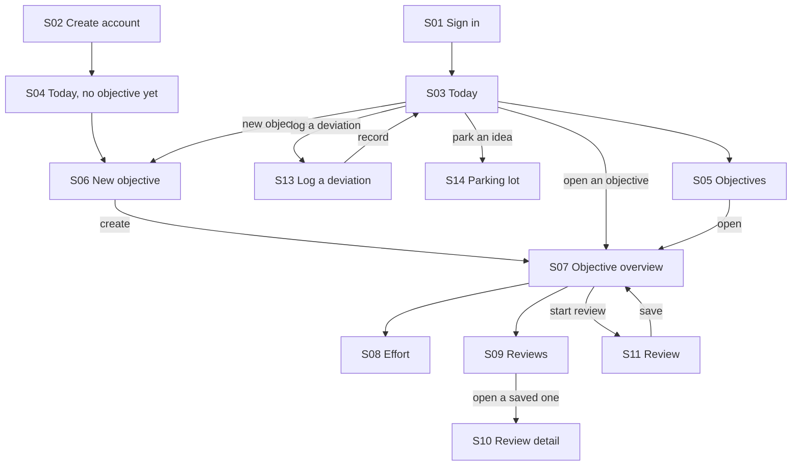
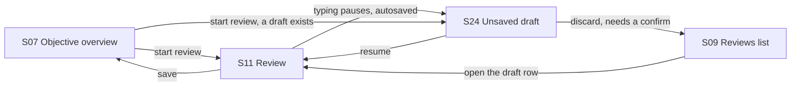

# Keel — flow diagrams

Source of truth is `Keel-FlowMap-v2.xlsx` (76 transitions, each with its failure path).
These diagrams are orientation only — they show success paths, and each answers one question.

## Main navigation

*Question: which screens carry the traffic?*

Today (S03) is the hub and Objective overview (S07) is the second. Almost nothing reaches a deep
screen without passing through one of them — which is where NFR-03's query budget is spent.

Drawn from T12–T22, T29–T31.

## The review draft loop

*Question: how do you get into and out of an unsaved review?*

S24 is a state, not a screen — you fall into it by walking away mid-review. Two entrances
(S07, S09) and two exits (resume, discard). The two exits were missing from the first version
of the flow map; drawing it as a loop is how they became obvious.

Drawn from T31, T44, T49, T71, T75, T76.

---

Rule for adding to this file: never draw the whole system. Draw the subset that answers a
question, and put the question above the diagram.
